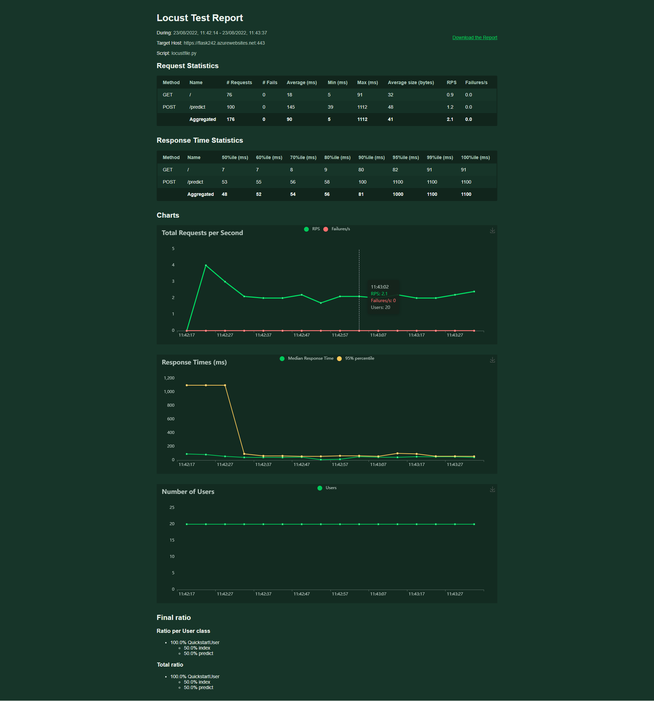

# Overview

Building a CI/CD pipeline using Azure pipelines
This Project showcases the understanding of deploying of a simple Flask ML
webapp.
This is the second project of Udacity Azure Devops Engineer Nanodegree  

## Project Plan
Project Plan

* [Trello](https://trello.com/invite/b/ODOmXQ1j/bf802ea5565e52c2a79cc932b071d270/buildina-a-ci-cd-pipeline)

* [Projectplan](https://docs.google.com/spreadsheets/d/1dfHD_L_i75A5C4FfSY8kLn8p6jqw2Hw3VbkOk0y4Rdc/edit?usp=sharing)

## Instructions

* Architectural Diagram

steps:
1. In Azure Cloudshell clone the repo
2. cd to directory CICD-pipeline-azure
3. create environment and activate it (if not yet created)
   - `make setup`
   - `source ~/.udacity-devops/bin/activate`
4. run `-r requirements.txt`
5. run the flask app `python3 app.py`
6. test the app locally by executing `make_prediction.sh` locally. Listen to the
   port 5000
7. Create a web app with `az webapp up --name <Your_unique_app_name> --resource-group <Your_RG> --runtime "PYTHON:3.7"`
8. After it is created go to the resource and open the ip adress
9. Edit the -X Post command in make_predict_azure_app.sh (-X POST https://<unique_app_name>.azurewebsites.net:$PORT/predict)
10. Verify whether the prediction is working by executing
    `./make_predict_azure_app.sh`
11. Build a self-hosted build server (if using a shared account like me)
12. Create pipeline in the project and connect it to the Github repository.
13. Don't forget to install Azure Pipelines and grant access to your repo from
    Github Marketplace
Ensure the service connection and pipeline agent is installed

* Project cloned into Azure Cloud Shell

* initial tests passed after `make all` command from the `Makefile`

* Github actions test result

* Prediction in Azure cloud shell

* Successful deploy of the project in Azure Pipelines.  [Note the official documentation should be referred to and double checked as you setup CI/CD](https://docs.microsoft.com/en-us/azure/devops/pipelines/ecosystems/python-webapp?view=azure-devops).

* Azure app service up after the 7th step

* Agent installed in a VM (Self-hosted build server)

* Pipeline deployed successfully

* Successful prediction from deployed flask app in Azure Cloud Shell.  

* Load test using locust to run execute `locust -f ./locustfile.py 

## Enhancements

All the infrastructure can be provisioned by an IaaS tool like Terraform

## Demo 

[myDemo](https://youtu.be/P6rxbPs5w1o)

